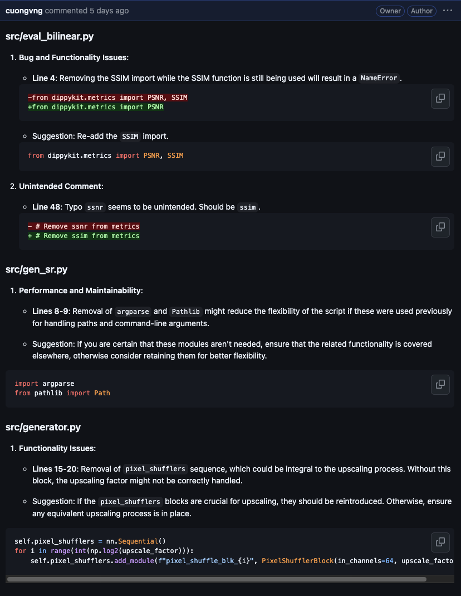

# GitHub Pull Request Review Assistant

Automatically review pull requests and provide feedback using OpenAI, triggered by GitHub webhook, ensuring correctness, security and readability.

## Prerequisites

- Node.js (v14 or later)
- npm (v6 or later)

## Installation

1. Clone the repository:

    ```bash
    git clone https://github.com/cuongvng/code-review-assistant.git
    cd github-pr-webhook-listener
    ```

2. Install the dependencies:

    ```bash
    npm install
    ```

## Configuration

1. Create a `.env` file in the `src` directory and add the following environment variables:

    ```env
    OPENAI_API_KEY=<your-openai-api-key>
    GITHUB_TOKEN=<your-github-token>
    ```

2. Update the `main` function in `src/github.ts` to handle the pull request event as needed.

## Usage

1. Start the server:

    ```bash
    npx tsx server.ts
    ```

2. Set up a webhook in the target GitHub repository:

    - Go to the target repository on GitHub.
    - Click on `Settings`.
    - In the left sidebar, click on `Webhooks`.
    - Click the `Add webhook` button.
    - In the `Payload URL` field, enter the URL of your server (e.g., `http://your-server-url/webhook`).
    - Set the `Content type` to `application/json`.
    - In the `Which events would you like to trigger this webhook?` section, select `Let me select individual events` and check `Pull requests`.
    - Click the `Add webhook` button to save the webhook.

## Example Review

From [this PR](https://github.com/cuongvng/srgan-pytorch/pull/1)



## Deployment

To make the server accessible to GitHub, you need to deploy it to a hosting service like Heroku, AWS, or any other cloud provider. Once deployed, use the deployed URL as the `Payload URL` when setting up the webhook in the target repository.

## License

This project is licensed under the MIT License. See the [LICENSE](LICENSE) file for details.